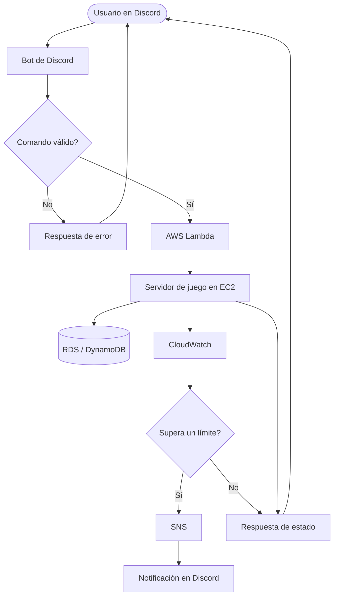
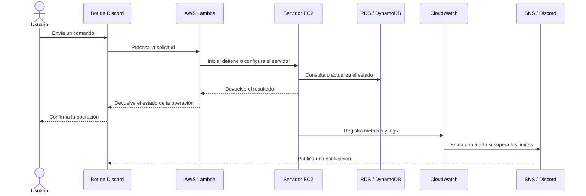
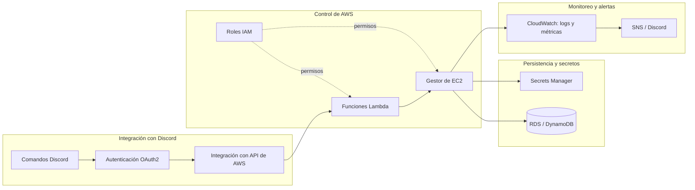

# Diagramas de arquitectura

Este documento describe el flujo principal del sistema, la comunicación entre sus servicios y la organización de sus componentes.

## Diagrama de flujo

## Diagrama de secuencia

## Diagrama de componentes

## Responsabilidades principales

| Componente | Responsabilidad |
| --- | --- |
| **Bot de Discord** | Recibe comandos, valida solicitudes y comunica resultados. |
| **AWS Lambda** | Ejecuta la lógica de control sin administrar servidores. |
| **EC2** | Aloja y ejecuta el servidor de juego. |
| **RDS / DynamoDB** | Conserva configuraciones y estados del juego. |
| **CloudWatch** | Centraliza logs, métricas y monitoreo. |
| **SNS** | Distribuye alertas y notificaciones. |
| **IAM** | Controla los permisos entre servicios. |
| **Secrets Manager** | Protege tokens, claves y otros secretos. |